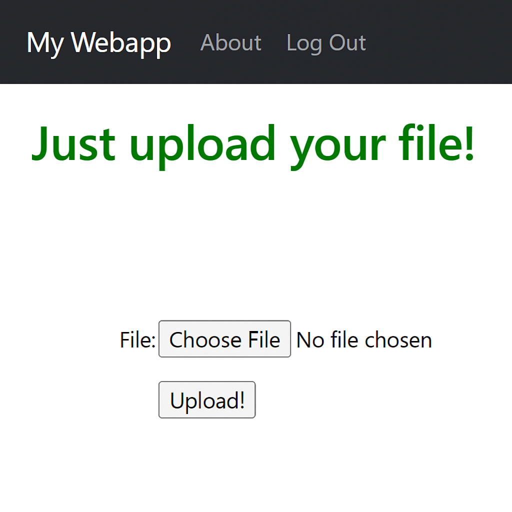

# Django Webapp Template

A production‑ready Django 4 template that lets you **upload files straight to Azure Blob Storage** while running locally in *two* Docker containers (Python + PostgreSQL). Use it as a starting point for SaaS dashboards, internal tools or any project that needs authenticated uploads at zero‑cost.



## ✨ Features

| Area | What’s included |
|------|-----------------|
| **File storage** | `django‑storages[azure]` backend pre‑configured to push user uploads to an Azure container. |
| **Auth** | Email/password signup & social log‑in powered by **django‑allauth**. |
| **UI** | Server‑rendered pages using **crispy‑bootstrap‑5** for clean, responsive forms. |
| **Docker** | Single‑command local dev stack: Python 3.10 app container + Postgres 13 database. |
| **Best practices** | `.gitignore`, VS Code settings, sensible `settings.py` split, environment variables via `environs`. |
| **Ready to deploy** | Works on Azure Container Apps, Render, Fly.io or any Docker host. |

## 🏗 Tech stack

| Layer | Tool | Version |
|-------|------|---------|
| Runtime | Python | 3.10.4 (slim‑bullseye) |
| Web framework | Django | 4.0.4 |
| Database | PostgreSQL | 13 |
| Storage | Azure Blob Storage | — |
| Auth & forms | django‑allauth / crispy‑bootstrap‑5 | 0.50.0 / 0.6 |

## 🚀 Quick start (Docker)

```bash
# 1. Clone
git clone https://github.com/felipeortizh/django-webapp-template.git
cd django-webapp-template

# 2. Configure secrets (edit docker-compose.yml or create a .env file)
export DJANGO_SECRET_KEY=your-django-key
export AZURE_ACCOUNT_NAME=your-storage-account
export AZURE_ACCOUNT_KEY=your-storage-key
export AZURE_CONTAINER=media

# 3. Build & run
docker compose up --build
# App → http://localhost:8000
```

The `docker-compose.yml` file builds the app image from the **Dockerfile**, mounts the code inside the container, maps `8000:8000`, and starts a named Postgres 13 service with a persisted volume.

## 🖥 Running locally without Docker

```bash
python -m venv .venv && source .venv/bin/activate
pip install -r requirements.txt
cp .env.example .env   # then fill in the Azure + Django secrets
python manage.py migrate
python manage.py runserver
```

## 🔑 Environment variables

| Variable | Purpose |
|----------|---------|
| `DJANGO_SECRET_KEY` | Django cryptographic key |
| `AZURE_ACCOUNT_NAME` | Storage account name |
| `AZURE_ACCOUNT_KEY` | Storage account access key |
| `AZURE_CONTAINER` | Name of the blob container that will hold uploads |

These are injected at runtime via `docker-compose.yml` and consumed by `settings.py`.

## 🗂 Project layout

```
.
├── MEDICAPP/        # Django project (settings, urls, wsgi)
├── accounts/        # Custom user & auth logic
├── almacenas/       # Uploads app (views, models, forms)
├── pages/           # Static and marketing pages
├── templates/       # Jinja‑like Django HTML templates
├── static/          # CSS/JS assets
├── Dockerfile
└── docker-compose.yml
```

## 🧩 Dependencies

```
asgiref==3.5.2
Django==4.0.4
psycopg2-binary==2.9.3
django-crispy-forms==1.14.0
crispy-bootstrap5==0.6
django-allauth==0.50.0
django-storages[azure]
environs[django]==9.5.0
```

The container is based on the official `python:3.10.4-slim-bullseye` image and installs these packages at build time.

## 🧪 Running tests

```bash
python manage.py test
```

Unit tests live beside each app inside a `tests.py` module.

## 📦 Production deployment

1. Build the image: `docker build -t myapp .`
2. Push to your registry (GHCR, ACR, Docker Hub…).
3. Set the same environment variables on your host / orchestrator.
4. Scale:

- **Azure Container Apps:** set `WORKERS_PER_INSTANCE` and enable a PostgreSQL Flexible Server.
- **Fly.io / Render / Railway:** simply point to your Postgres URL.

## 🙌 Contributing

PRs are welcome! Open an issue to discuss new features or improvements first.

## © License

MIT – see **LICENSE** for details (to be added).

---

Made with ❤️ by Felipe Ortiz.
